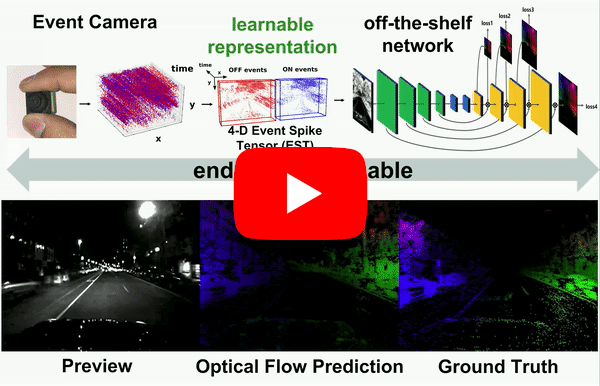
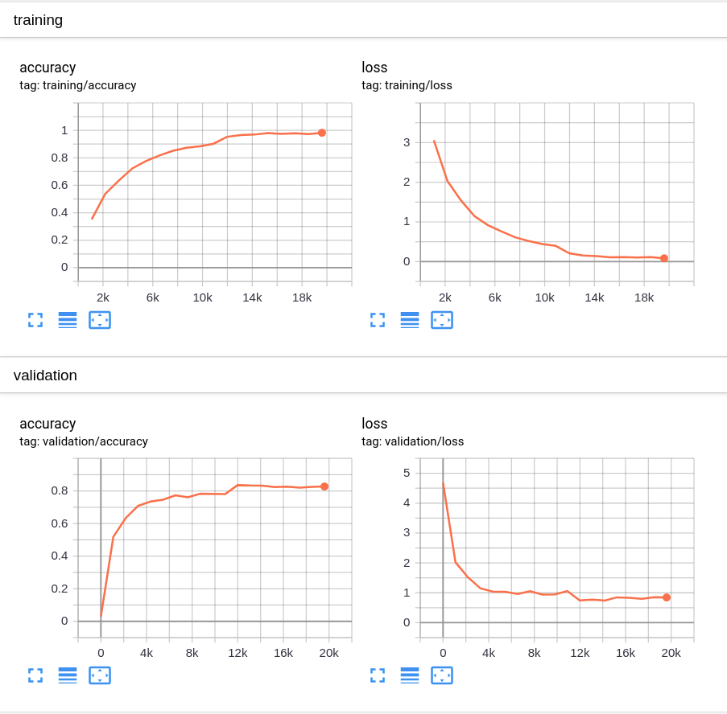

# Event Representation Learning

[](https://youtu.be/bQtSx59GXRY)

This repository contains learning code that implements 
event representation learning as described in Gehrig et al. ICCV'19.

If you use this code in an academic context, please cite the following work:

[Daniel Gehrig](https://danielgehrig18.github.io/), [Antonio Loquercio](https://antonilo.github.io/), Konstantinos G. Derpanis, Davide Scaramuzza, "End-to-End Learning of Representations 
for Asynchronous Event-Based Data", The International Conference on Computer Vision (ICCV), 2019

```
@InProceedings{Gehrig_2019_ICCV,
  author = {Daniel Gehrig and Antonio Loquercio and Konstantinos G. Derpanis and Davide Scaramuzza},
  title = {End-to-End Learning of Representations for Asynchronous Event-Based Data},
  booktitle = {Int. Conf. Comput. Vis. (ICCV)},
  month = {October},
  year = {2019}
}
```

## Requirements

* Python 3.7
* virtualenv
* cuda 10

## Dependencies
Create a virtual environment with `python3.7` and activate it

    virtualenv venv -p /usr/local/bin/python3.7
    source venv/bin/activate

Install all dependencies by calling 

    pip install -r requirements.txt
   
## Training
Before training, download the `N-Caltech101` dataset and unzip it

    wget http://rpg.ifi.uzh.ch/datasets/gehrig_et_al_iccv19/N-Caltech101.zip 
    unzip N-Caltech101.zip
    
Then start training by calling

    python main.py --validation_dataset N-Caltech101/validation/ --training_dataset N-Caltech101/training/ --log_dir log/temp --device cuda:0

Here, `validation_dataset` and `training_dataset` should point to the folders where the training and validation set are stored.
`log_dir` controls logging and `device` controls on which device you want to train. Checkpoints and models with lowest validation loss will be saved in the root folder of `log_dir`.

### Additional parameters 
* `--num_worker` how many threads to use to load data
* `--pin_memory` wether to pin memory or not
* `--num_epochs` number of epochs to train
* `--save_every_n_epochs` save a checkpoint every n epochs.
* `--batch_size` batch size for training

### Visualization

Training can be visualized by calling tensorboard

    tensorboard --logdir log/temp

Training and validation losses as well as classification accuracies are plotted. In addition, the learnt representations are visualized. The training and validation curves should look something like this:    


## Testing
Once trained, the models can be tested by calling the following script:

    python testing.py --test N-Caltech101/testing/ --device cuda:0

Which will print the test score after iteration through the whole dataset.

    
